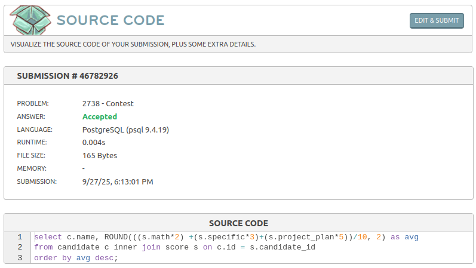

# Concurso
Link do desafio: [Concurso](https://www.beecrowd.com.br/judge/pt/problems/view/2738)

- **Resolução do desafio**:



- **Solução**:
```
select c.name, ROUND(((s.math*2) +(s.specific*3)+(s.project_plan*5))/10, 2) as avg 
from candidate c inner join score s on c.id = s.candidate_id
order by avg desc;
```