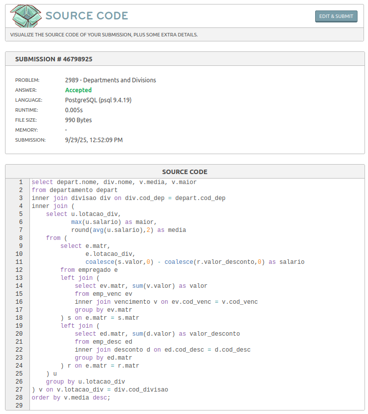

# Departamentos e divisões

Link do desafio: [Departamentos e divisões](https://www.beecrowd.com.br/judge/pt/problems/view/2989)

- **Resolução do desafio**:



- **Solução**:
```
select depart.nome, div.nome, v.media, v.maior
from departamento depart
inner join divisao div on div.cod_dep = depart.cod_dep
inner join (
    select u.lotacao_div,
           max(u.salario) as maior,
           round(avg(u.salario),2) as media
    from (
        select e.matr,
               e.lotacao_div,
               coalesce(s.valor,0) - coalesce(r.valor_desconto,0) as salario
        from empregado e
        left join (
            select ev.matr, sum(v.valor) as valor
            from emp_venc ev
            inner join vencimento v on ev.cod_venc = v.cod_venc
            group by ev.matr
        ) s on e.matr = s.matr
        left join (
            select ed.matr, sum(d.valor) as valor_desconto
            from emp_desc ed
            inner join desconto d on ed.cod_desc = d.cod_desc
            group by ed.matr
        ) r on e.matr = r.matr
    ) u
    group by u.lotacao_div
) v on v.lotacao_div = div.cod_divisao
order by v.media desc;
```