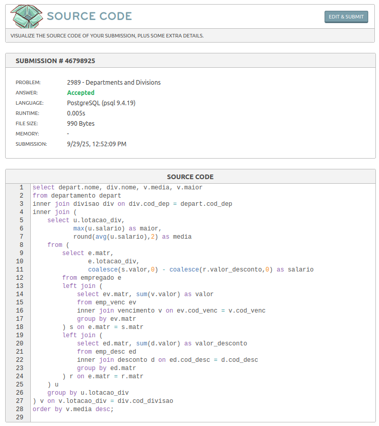

# Departamentos e divisões

Link do desafio: [Departamentos e divisões](https://www.beecrowd.com.br/judge/pt/problems/view/2989)

- **Resolução do desafio**:



- **Solução**:
```sql
SELECT 
    depart.nome, 
    div.nome, 
    v.media, 
    v.maior
FROM departamento depart
INNER JOIN divisao div 
    ON div.cod_dep = depart.cod_dep
INNER JOIN (
    SELECT 
        u.lotacao_div,
        MAX(u.salario) AS maior,
        ROUND(AVG(u.salario), 2) AS media
    FROM (
        SELECT 
            e.matr,
            e.lotacao_div,
            COALESCE(s.valor, 0) - COALESCE(r.valor_desconto, 0) AS salario
        FROM empregado e
        LEFT JOIN (
            SELECT 
                ev.matr, 
                SUM(v.valor) AS valor
            FROM emp_venc ev
            INNER JOIN vencimento v 
                ON ev.cod_venc = v.cod_venc
            GROUP BY ev.matr
        ) s 
            ON e.matr = s.matr
        LEFT JOIN (
            SELECT 
                ed.matr, 
                SUM(d.valor) AS valor_desconto
            FROM emp_desc ed
            INNER JOIN desconto d 
                ON ed.cod_desc = d.cod_desc
            GROUP BY ed.matr
        ) r 
            ON e.matr = r.matr
    ) u
    GROUP BY u.lotacao_div
) v 
    ON v.lotacao_div = div.cod_divisao
ORDER BY v.media DESC;
```