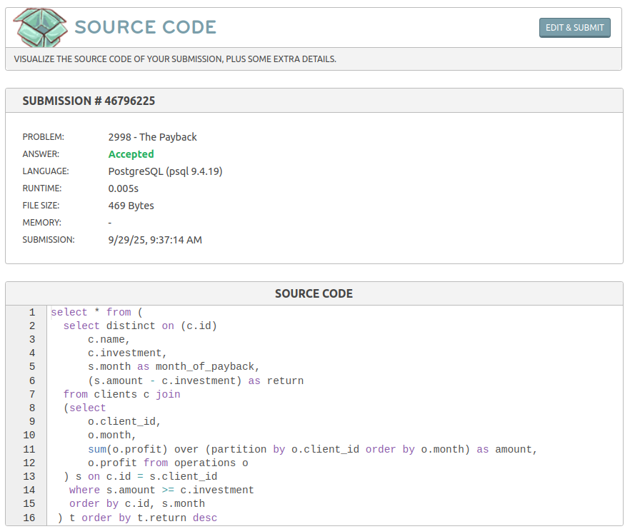

# The Payback
Link do desafio: [The payback](https://www.beecrowd.com.br/judge/pt/problems/view/2998)

- **Resolução do desafio**:



- **Solução**:
```
select * from (
  select distinct on (c.id)
      c.name, 
      c.investment,
      s.month as month_of_payback,
      (s.amount - c.investment) as return 
  from clients c join 
  (select 
      o.client_id,
      o.month,
      sum(o.profit) over (partition by o.client_id order by o.month) as amount,
      o.profit from operations o
  ) s on c.id = s.client_id 
   where s.amount >= c.investment
   order by c.id, s.month
 ) t order by t.return desc
```