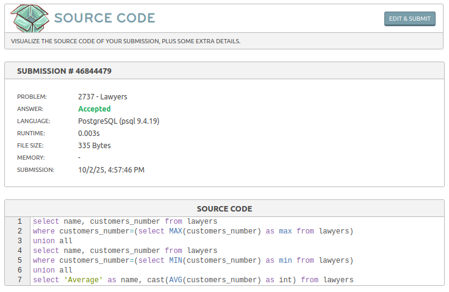

# Advogados

Link do desafio: [Advogados](https://www.beecrowd.com.br/judge/pt/problems/view/2737)

- **Resolução do desafio**:



- **Solução**:
```sql
select name, customers_number from lawyers 
where customers_number=(select MAX(customers_number) as max from lawyers)
union all
select name, customers_number from lawyers 
where customers_number=(select MIN(customers_number) as min from lawyers)
union all
select 'Average' as name, cast(AVG(customers_number) as int) from lawyers
```