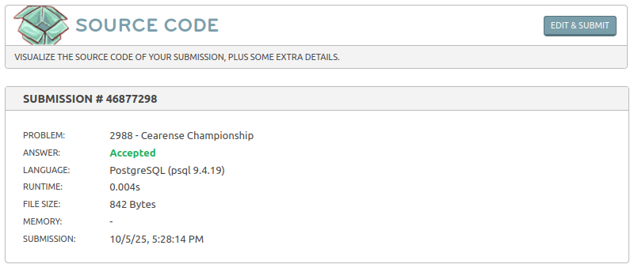

# Campeonato Cearense

- Link do desafio: [Campeonato Cearense](https://www.beecrowd.com.br/judge/pt/problems/view/2988)

- **Resolução do desafio**:



- **Solução**:
```sql
SELECT t.NAME, 
Count( * ) AS matches, 
Sum(
  CASE 
  	WHEN (t.id = m.team_1 AND m.team_1_goals > m.team_2_goals) 
  	OR (t.id = m.team_2 AND m.team_2_goals > m.team_1_goals) 
  	THEN 1 ELSE 0 
  END
) AS vitorias,
Sum(
  CASE 
  	WHEN (t.id = m.team_1 AND m.team_1_goals < m.team_2_goals) 
  	OR (t.id = m.team_2 AND m.team_2_goals < m.team_1_goals) 
  	THEN 1 ELSE 0 
  END
) AS derrotas,
Sum(
  CASE 
  	WHEN m.team_1_goals = m.team_2_goals 
  	THEN 1 ELSE 0 
  END
) AS empates,
SUM(
  CASE 
  	WHEN (t.id = m.team_1 AND m.team_1_goals > m.team_2_goals) OR (t.id = m.team_2 AND m.team_2_goals > m.team_1_goals) THEN 3 
  	WHEN m.team_1_goals = m.team_2_goals 
  	THEN 1 ELSE 0 
  END
) AS pontos
FROM teams t LEFT JOIN matches m ON t.id = m.team_1 OR t.id = m.team_2 
GROUP BY t.NAME 
ORDER BY pontos DESC;
```