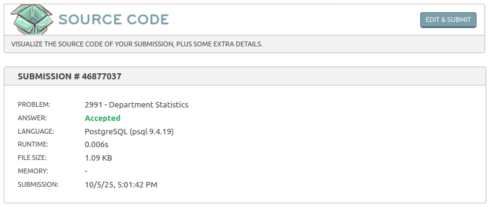

# Estatísticas dos Departamentos

- Link do desafio: [Estatísticas dos Departamentos](https://www.beecrowd.com.br/judge/pt/problems/view/2991)

- **Resolução do desafio**:



- **Solução**:
```sql
select depart.nome as departamento,
  sum(v.trabalhadores) as numeros_de_empregados,
  round(avg(v.salario),2) as media_salario,
  max(v.salario) as maior_salario,
  min(v.salario) as menor_salario
from departamento depart
inner join divisao div on div.cod_dep = depart.cod_dep
inner join (
    select
    u.lotacao_div,
    count(u.matr) as trabalhadores,
    u.salario as salario
    from (
        select
        e.matr,
        e.lotacao_div,
        coalesce(s.valor, 0) - coalesce(r.valor_desconto, 0) as salario
        from empregado e left join (
            select
            ev.matr,
            sum(v.valor) as valor
            from emp_venc ev
            inner join vencimento v on ev.cod_venc = v.cod_venc
            group by ev.matr
        ) s on e.matr = s.matr left join (
            select
            ed.matr,
            sum(d.valor) as valor_desconto
            from emp_desc ed
            inner join desconto d on ed.cod_desc = d.cod_desc
            group by ed.matr
        ) r on e.matr = r.matr
    ) u group by u.lotacao_div, u.salario
) v on v.lotacao_div = div.cod_divisao
group by depart.nome
order by media_salario desc;
```