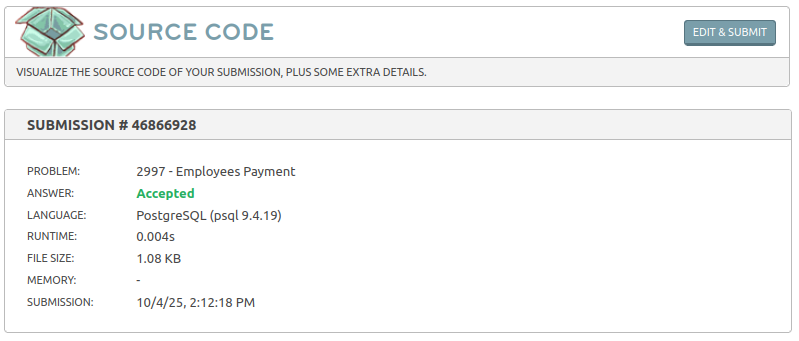

# Pagamento dos Empregados

- Link do desafio: [Pagamento dos Empregados](https://www.beecrowd.com.br/judge/pt/problems/view/2997)

- **Resolução do desafio**:



- **Solução**:
```sql
select
    depart.nome as Departamento,
    u.nome as Empregado,
    u.salario as Salario_Bruto,
    u.desconto as Total_Descontos,
    u.salario_liquido as Salario_Liquidoaws
from departamento depart
         inner join divisao div on div.cod_dep = depart.cod_dep
         inner join (
    select
        e.matr,
        e.nome,
        e.lotacao_div,
        coalesce(s.valor, 0) as salario,
        coalesce(r.valor_desconto, 0) as desconto,
        coalesce(s.valor, 0) - coalesce(r.valor_desconto, 0) as salario_liquido
    from empregado e left join (
        select
            ev.matr,
            sum(v.valor) as valor
        from emp_venc ev
                 inner join vencimento v on ev.cod_venc = v.cod_venc
        group by ev.matr
    ) s on e.matr = s.matr left join (
        select
            ed.matr,
            sum(d.valor) as valor_desconto
        from emp_desc ed
                 inner join desconto d on ed.cod_desc = d.cod_desc
        group by ed.matr
    ) r on e.matr = r.matr
) u on u.lotacao_div = div.cod_divisao
order by Salario_Liquidoaws desc;
```